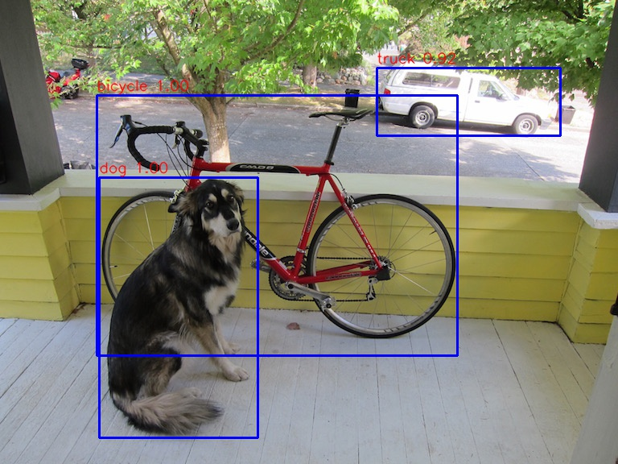

# image-determination-with-YOLO-method
In this the image determination with Yolo Method

Step 1. Prerequisite
---------------------------------
_Before everything, install these things on your system
* [Anaconda](https://www.anaconda.com/distribution/). 
* [Yolo Data File](https://drive.google.com/file/d/1yT2-zmNFymMgY42Z72LIuqMaiWvYEUQR/view?usp=sharing). 
* [This Repository](https://github.com/Shubham0Rajput/image-determination-with-YOLO-method/archive/master.zip)

### After Downloading  Anaconda Write these command into Anaconda Promt ###
* For installing Python
```
  conda install -c conda-forge python
```

* For installing OpenCV
```
  conda install -c conda-forge opencv
```

* For installing Jupyter Labs
```
  conda install -c conda-forge jupyterlab
```


Step 2. Running The code
---------------------------------
1. Open the Jupyter Lab (in the same Directory the the code.ipynb is stored)
```
jupyter notebook
```
2. Copy yolo.h5 to 
```
YOLOv3/data/
```
3. Open the code.ipynb from Home Page of Jupyter Notebook
4. Press Shift+Enter to Run the code


Also 
---------------------------------
The already stored photo to Detection of Cat and Dog can be changed 
#### Change the "image" in code ####


## WORKING ##


